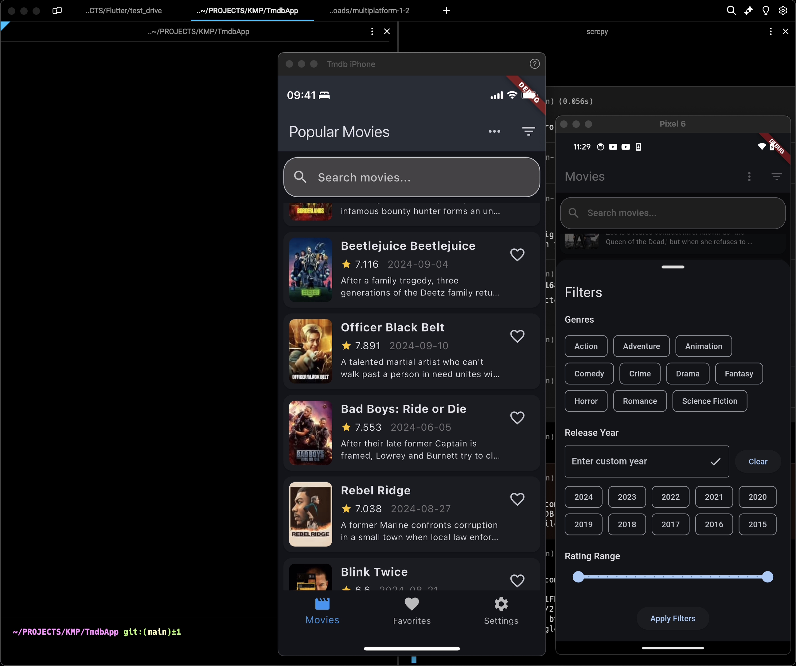

# TMDB Movie App

## Overview

This Flutter app interacts with The Movie Database (TMDB) API to display and manage movie information. Made by LLM

## Current state





The app offers the following key features:

- Browse movies by different categories (popular, top-rated, upcoming, now playing)
- Search for movies
- View detailed movie information
- Mark movies as favorites
- Apply filters (genre, release year, rating range)
- Toggle between light and dark themes
- Persistent storage of favorites

## Setup

1. Get a TMDB API key from [themoviedb.org](https://www.themoviedb.org/).
2. Create a `lib/config.dart` file based on the `lib/config.template.dart` file:
   ```dart
   class Config {
     static const String apiKey = 'your_api_key_here';
   }
   ```
3. Run `flutter pub get` to install dependencies.
4. Run the app using `flutter run`.

## Tech Stack

- **Language**: Dart
- **UI Framework**: Flutter
- **Architecture**: Stateful Widgets with some separation of concerns
- **Networking**: http package
- **JSON Parsing**: dart:convert
- **State Management**: setState and StreamController for favorites
- **Navigation**: Flutter's built-in navigation
- **Data Persistence**: shared_preferences for storing favorites
- **UI Components**: Material Design
- **Build System**: Flutter's built-in build system
- **Minimum SDK**: Flutter 3.5.3

## Key Features

1. Browse movies by different categories (popular, top-rated, upcoming, now playing)
2. Search for movies
3. View detailed movie information
4. Mark movies as favorites
5. Apply filters (genre, release year, rating range)
6. Toggle between light and dark themes
7. Persistent storage of favorites

## Architecture

The app uses a simple architecture based on stateful widgets:

- Model: Represented by the movie data structure (Map<String, dynamic>)
- View: Flutter widgets in various screen files
- Controller: Logic embedded within stateful widgets (e.g., _MovieListPageState)

## Data Flow

1. The `_MovieListPageState` fetches data directly from the TMDB API
2. Data is stored in the widget's state and exposed to the UI components
3. UI components rebuild when the state changes using setState
